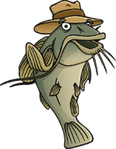

# Jeu de la barbotte

## But de l'exercice
Le but ici est de réchauffer vos neuronnes pour les cours d'orienté Objet. Tu devras compléter l'interface graphique afin de faire fonctionner le jeu de la barbotte.

## C'est quoi la barbotte
C'est  un  jeu  de  dé  entre  2  personnes.  Le  tirage  est  fait  de  façon aléatoire.  Après  tirage  des  2  dés  la  somme  des  faces  supérieures  est calculée. Si cette somme vaut 7 ou 11 au premier jet le joueur gagne. Si  elle  vaut  2,  3  ou  12  au  premier  jet,  le  joueur  perd.  Sinon  si  la somme vaut autre chose que ce qu'on a cité au premier jet alors elle forme  les  points  du  joueur.  Dans  ce  cas  le  joueur  continue  à  jouer  le dé  jusqu'à  ce  qu'il  refasse  ces  points  c'est  à  dire  qu'il  lance  la  même valeur  que  son  premier  jet  pour  gagner.  Le  joueur  perd  s'il  lace  une somme de 7 avant de refaire ces points

